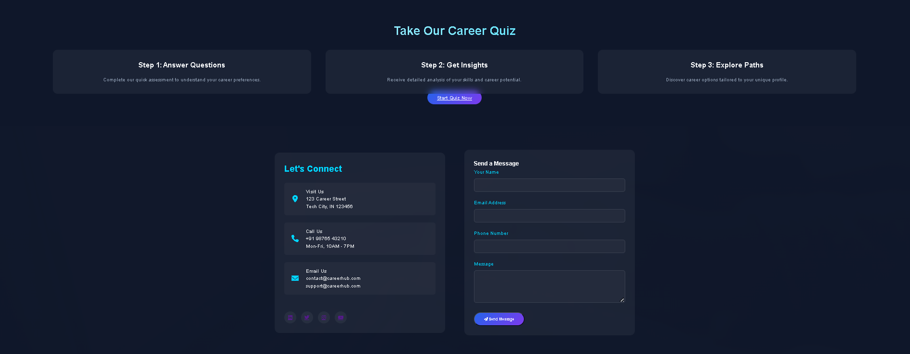
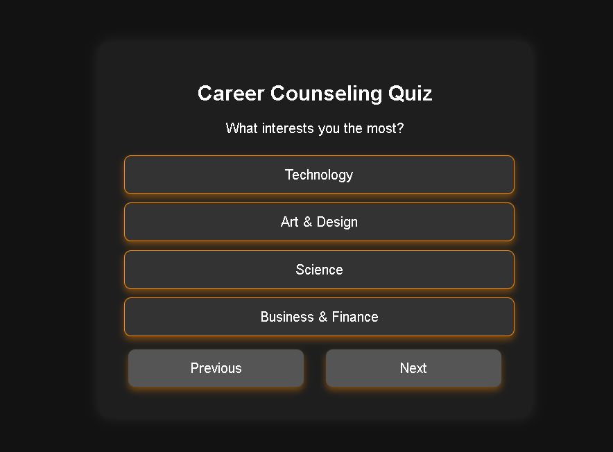
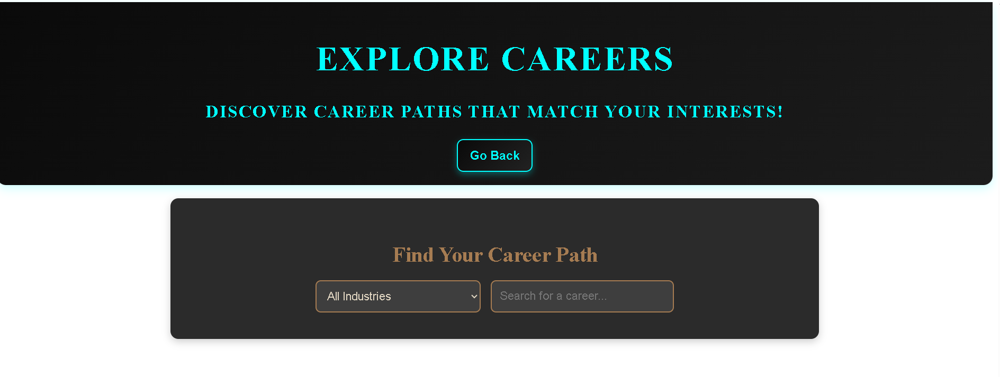
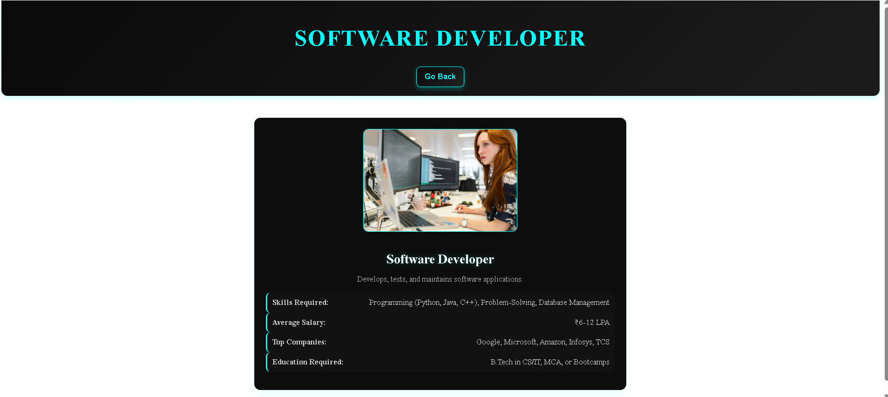

-->> Kario-K 🚀  

 AI-Powered Career Counseling System  

Kario-K is an AI-based career counseling system that helps students find the best career options based on their interests and skills.  


-->> Features  
✅ AI-based career recommendations  
✅ Personalized career roadmap  
✅ Quiz to assess student skills  
✅ Interactive dashboard  

---

-->> Installation  

1. Clone the repository: 
   ```sh
   git clone https://github.com/Lokoiee04894/Kario-K.git
   cd Kario-K


📸 Screenshots  

🏠 Home Page  
  

📊 Dashboard  
  

📝 Form Section  
  

🧠 Quiz  
  

🔍 Explore Section  
  

🚀 Career Section  
  

ℹ️ Information Page  
  


 💡 Future Enhancements  

- Integration of AI-based career counseling  
- Real-time recommendations  
- Improved UI/UX design  

 📞 Contact  

📧 Email: kaif27293@gmail.com  
🔗 GitHub: [Kario-K](https://github.com/Lokoiee04894/Kario---K)

⭐ If you like this project, give it a star! ⭐  
